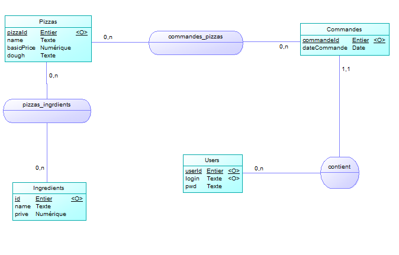
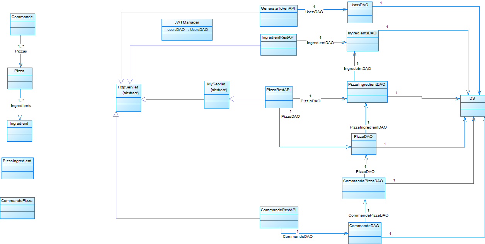

# SAE 401

Membres :

- DASSONVILLE Valentin Groupe H
- PETIT Gwenael Groupe H

## MCD



## Script SQL création de la base

```sql
CREATE TABLE ingredients(
    id int PRIMARY KEY,
    name text,
    price numeric
);

CREATE TABLE pizzas(
    id int PRIMARY KEY,
    name text,
    basicPrice numeric,
    dough text
);

CREATE TABLE pizzas_ingredients(
    pizzaId int,
    ingredientId int,
    PRIMARY KEY(pizzaId, ingredientId),
    FOREIGN KEY(pizzaId) REFERENCES pizzas(id) ON DELETE CASCADE,
    FOREIGN KEY(ingredientId) REFERENCES ingredients(id) ON DELETE CASCADE
);

CREATE TABLE users(
    id int PRIMARY KEY,
    login text,
    password text
);

CREATE TABLE commandes(
    id int PRIMARY KEY,
    userId int,
    dateCommande date,
    FOREIGN KEY(userId) REFERENCES users(id)
);

CREATE TABLE commandes_pizzas(
    commandeId int,
    pizzaId int,
    PRIMARY KEY(commandeId, pizzaId),
    FOREIGN KEY(commandeId) REFERENCES commandes(id),
    FOREIGN KEY(pizzaId) REFERENCES pizzas(id) ON DELETE CASCADE
);
```

## Diagramme de classe



Les classes plus détaillées sont disponibles dans le dossier `classUML` du repo Git.

## Endpoints

Le fichier `RESTED_SAE.txt` sur le repo Git permet d'importer une collection sur RESTED avec toutes les requêtes sur les différents endpoints.

Pour toutes les requêtes autre que GET, il faut générer un token sur le endpoint `/users/token` (présent dans la collection RESTED) et l'ajouter dans le champ Authorization du header de la requête.

### Ingredients

| HTTP | URI | En-tête | Corps requête | Réponse |
| ---  | --- | ---     | ---           | ---     |
| GET  | /ingredients | | | Obtenir la collection de tous les ingrédients |
| GET  | /ingredients/{id} | | | - Obtenir un ingrédient particulier par son id <br>- 404 si l'ingrédient n'existe pas |
| GET | /ingredients/{id}/name | | | - Obtenir uniquement le nom d’un ingrédient spécifique <br>- 404 si l'ingrédient n'existe pas |
| POST | /ingredients | Authorization : Bearer "token" | Ingredient JSON | - Ajouter un nouvel ingrédient <br> - 409 si l'ingrédient existe déjà |
| DELETE | /ingredients/{id} | Authorization : Bearer "token" | | - Supprimer un ingrédient <br> - 404 si l'ingrédient n'existe pas |

#### DTO JSON

```json
{
    "id": 1,
    "name": "pomme de terre",
    "price": 0.4
}
```

### Pizzas

| HTTP | URI | En-tête | Corps requête | Réponse |
| ---  | --- | ---     | ---           | ---     |
| GET  | /pizzas | | | Obtenir la collection de toutes les pizzas |
| GET | /pizzas/{id} | | | - Obtenir une pizza en particulier <br> - 404 si la pizza n'existe pas |
| POST | /pizzas | Authorization : Bearer "token" | Pizza JSON | - Ajout d’une nouvelle pizza avec ses ingrédients <br> - 409 si la pizza existe déjà |
| DELETE | /pizzas/{id} | Authorization : Bearer "token" | | - Suppression d'une pizza <br> - 404 si la pizza n'existe pas |
| PATCH | /pizzas/{id} | Authorization : Bearer "token" | Pizza JSON (valeurs à changer) | - Modification d’un attribut d’une pizza <br> - 404 si la pizza n'existe pas <br> - 401 s'il y a tentative de changement de l'id |
| POST | /pizza/{id} | Authorization : Bearer "token" | Ingredient JSON | - Ajout d’un ingrédient à une pizza <br> - 404 si la pizza n'existe pas <br> - 409 si l'ingrédient est déjà sur la pizza |
| DELETE | /pizzas/{id}/{idIngredient} | Authorization : Bearer "token" | | - Suppression d'un ingrédient d'une pizza <br> - 404 si l'ingrédient n'est pas sur la pizza |
| GET | /pizzas/{id}/prixfinal | | | - Obtenir le prix final de la pizza <br> - 404 si la pizza n'existe pas |

#### DTO JSON

```json
{
    "id": 1,
    "name": "savoyarde",
    "basicPrice": 10,
    "dough": "napolitaine",
    "ingredients": [
      {
        "id": 1,
        "name": "pomme de terre",
        "price": 0.4
      },
      {
        "id": 4,
        "name": "lardons",
        "price": 1
      },
      {
        "id": 9,
        "name": "fromage",
        "price": 2
      }
    ]
}
```

### Commandes

| HTTP | URI | En-tête | Corps requête | Réponse |
| ---  | --- | ---     | ---           | ---     |
| GET  | /commandes | | | Liste des commandes en cours |
| GET  | /commandes/{id} | | | - Obtenir le détail d’une commande <br> - 404 si la commande n'existe pas |
| POST | /commandes | Authorization : Bearer "token" | Commande JSON | - Enregistrement d’une nouvelle commande <br> - 409 si la commande existe déjà |
| GET  | /commandes/{id}/prixfinal | | | - Récupérer le prix final d'une commande <br> - 404 si la commande n'existe pas |

#### DTO JSON

```json
{
    "id": 1,
    "userId": 1,
    "dateCommande": "2023-02-27",
    "pizzas": [
        {  
            "id": 1,
            "name": "savoyarde",     
            "basicPrice": 10,     
            "dough": "napolitaine",     
            "ingredients": [
                {         
                    "id": 1,         
                    "name": "pomme de terre",         
                    "price": 0.4
                },       
                {         
                    "id": 4,         
                    "name": "lardons",         
                    "price": 1      
                },       
                {         
                    "id": 9,         
                    "name": "fromage",         
                    "price": 2       
                }]   
        }]
} 

```

### Utilisateurs

| HTTP | URI | En-tête | Corps requête | Réponse |
| ---  | --- | ---     | ---     | ---     |
| GET  | /users/token | | Paramètres : <br> - login <br> - pwd | - Un token JWT d'une durée de 30 minutes <br> - 404 si tout les paramètres ne sont pas là <br> - 401 si aucun compte n'est relié aux identifiants 